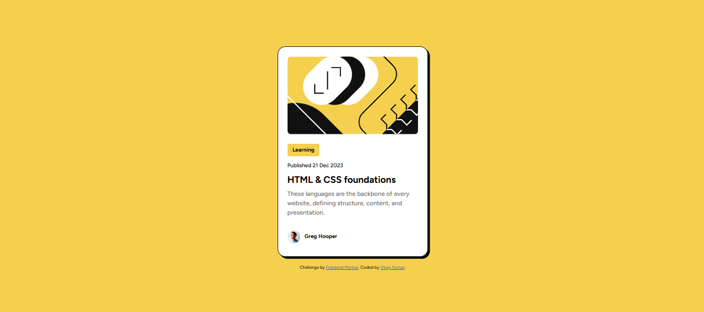

# Frontend Mentor - 📰 Blog preview card solution

This is a solution to the [Blog preview card challenge on Frontend Mentor](https://www.frontendmentor.io/challenges/blog-preview-card-ckPaj01IcS). Frontend Mentor challenges help you improve your coding skills by building realistic projects. 

## Table of contents

- [Overview](#overview)
  - [The challenge](#the-challenge)
  - [Screenshot](#screenshot)
  - [Links](#links)
- [My process](#my-process)
  - [Built with](#built-with)
  - [What I learned](#what-i-learned)
- [Author](#author)

## Overview

### The challenge
The goal was to create a simple and clean blog card layout. The design includes:
- Blog thumbnail image
- Category tag
- Title and short description
- Author information
- See hover and focus states for all interactive elements on the page

### Screenshot

### Links

- Solution URL: [Add solution URL here](https://your-solution-url.com)
- Live Site URL: [Add live site URL here](https://your-live-site-url.com)

## My process

### 🛠 Built with

- Semantic HTML5
- CSS Flexbox
- Mobile-first workflow
- Fonts : Figtree
- Frontend Mentor starter design

### What I learned

I improved my understanding of:
- Flexbox layout structure
- Responsive design techniques
- Aligning content using `gap`, `justify-content`, and `align-items`
- Styling components with padding, margin, and border-radius

## Author

- Website - [Vinay Kumar](https://www.your-site.com)
- Frontend Mentor - [@vinay-kumar-3](https://www.frontendmentor.io/profile/vinay-kumar-3)

